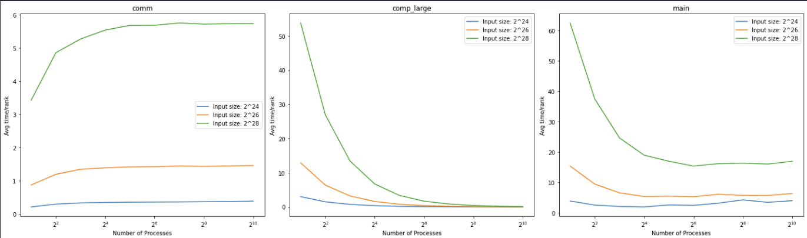
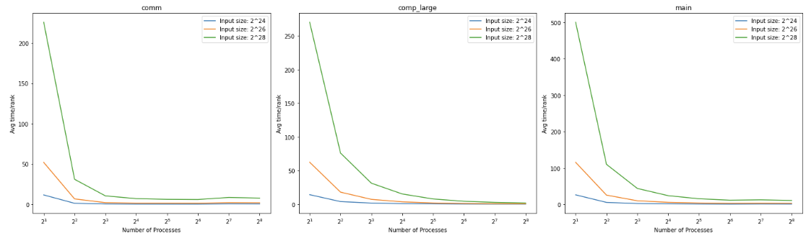
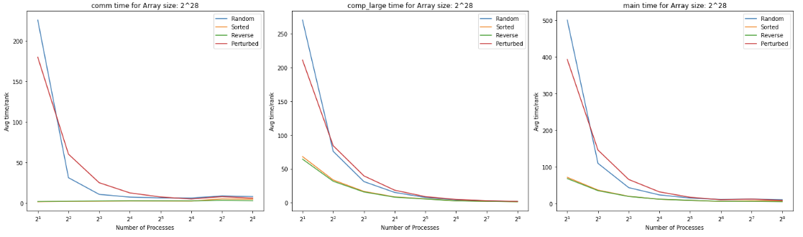

# CSCE 435 Group project

## 0. Group number: 9

## 1. Group members:

1. Rahul Singh

2. Kevin Thomas

3. Anthony Ciardelli

4. Brandon Thomas

### Team Communication:

We will be using iMessage as our primary method of communication. We will share documents and information via Google Docs.

## 2. Project topic (e.g., parallel sorting algorithms)

### 2a. Brief project description (what algorithms will you be comparing and on what architectures)

#### Bitonic Sort:

A bitonic sort implementation parallelizes the butterfly-pattern comparisons of bitonic sequences across processors, where each stage doubles the size of sorted subsequences by having processors exchange data with partners at varying "distances" (rank offsets), performing compare-and-swap operations locally, until the entire sequence is sorted in ascending or descending order across all processors.

  
#### Sample Sort:

The algorithm begins by distributing data evenly across processes. Each process then sorts its local data and selects regular samples, which are gathered and used to choose splitters that partition the data range. The splitters are used to redistribute the data using all-to-all communication so each process receives elements in its designated range, followed by a final local sort on each process.

  
#### Merge Sort:

This algorithm is a parallelized implementation of merge sort. The global array is divided into a number of segments that match the number of processes. Then, merge sort is run on each of the processes independently. It recursively divides the subarrays until there is one element in each subarray. Then, it procedurally merges and sorts each subarray until every element has been sorted. After each segment is sorted, a final merge is performed to create the fully sorted array.


#### Radix Sort:

This implementation performs parallel radix sort by first distributing data across processors based on the most significant bits (determined by the number of processors). Each processor then performs a local radix sort using counting sort on 8-bit chunks, with the final result remaining distributed across the processors in sorted order.

### 2b. Pseudocode for each parallel algorithm

- For MPI programs, include MPI calls you will use to coordinate between processes

#### Sample Sort:

```

function sampleSort(local_data, world_rank, world_size):

    // Start Caliper measurement for entire Sample Sort

  

    // 1. Local sorting phase

    // Start Caliper measurement for local sort

    sort(local_data)

    // End Caliper measurement for local sort

  

    // 2. Sample selection phase

    // Start Caliper measurement for sample selection

    samples = select_samples(local_data, world_size)

    // End Caliper measurement for sample selection

  

    // 3. Global splitter selection phase

    // Start Caliper measurement for global splitter selection

    splitters = gather_and_select_global_splitters(samples, world_rank, world_size)

    // End Caliper measurement for global splitter selection

  

    // 4. Data partitioning phase

    // Start Caliper measurement for data partitioning

    partitioned_data = partition_data(local_data, splitters)

    // End Caliper measurement for data partitioning

  

    // 5. All-to-all exchange phase

    // Start Caliper measurement for all-to-all exchange

    received_data = all_to_all_exchange(partitioned_data, world_rank, world_size)

    // End Caliper measurement for all-to-all exchange

  

    // 6. Final local sorting phase

    // Start Caliper measurement for final local sort

    sort(received_data)

    // End Caliper measurement for final local sort

  

    // End Caliper measurement for entire Sample Sort

    return received_data

  

function main():

    // Initialize MPI

    // Get world_rank and world_size

    // Read or generate input data

    sorted_data = sampleSort(local_data, world_rank, world_size)

    // Gather results to rank 0 or write to file

    // Finalize MPI

```

  
#### Bitonic Sort

```

// Function to compare and exchange two elements

function compareExchange(data, i, j, ascending):

    // Compare elements at indices i and j

    // Swap if they are in the wrong order based on 'ascending' flag

  

// Function to merge a bitonic sequence

function bitonicMerge(data, low, count, ascending):

    // If count > 1:

    //     Find the greatest power of 2 less than count

    //     Compare-exchange pairs of elements

    //     Recursively merge the two halves

  

// Function to generate a bitonic sequence

function bitonicSort(data, low, count, ascending):

    // If count > 1:

    //     Recursively sort first half in ascending order

    //     Recursively sort second half in descending order

    //     Merge the resulting bitonic sequence

  

// Main MPI Bitonic Sort function

function mpiBitonicSort(local_data, world_rank, world_size):

    total_size = local_data.size() * world_size

    local_size = local_data.size()

  

    // Bitonic sort stages

    for k = 2 to total_size:

        for j = k/2 to 1 (dividing by 2 each iteration):

            // Start Caliper measurement for local compare-exchange

            for each element i in local_data:

                // Calculate the index of the element to compare with

                // If the partner element is in the same process:

                //     Perform local compare-exchange

                // Else:

                //     Start Caliper measurement for MPI exchange

                //     Use MPI_Sendrecv to exchange and compare elements with partner process

                //     End Caliper measurement for MPI exchange

            // End Caliper measurement for local compare-exchange

  

// Main function

function main():

    // Initialize MPI

    // Get world_rank and world_size

    // Read or generate input data

    // Start Caliper measurement for entire MPI Bitonic Sort

    mpiBitonicSort(local_data, world_rank, world_size)

    // End Caliper measurement for entire MPI Bitonic Sort

    // Gather results to rank 0 or write to file

    // Finalize MPI

```

  
#### Merge Sort

```

// Function to merge two sorted arrays

function merge(left_array, right_array):

    // Merge the two arrays and return the result

  

// Function to perform local merge sort

function localMergeSort(array):

    // If array size > 1:

    //     Divide array into two halves

    //     Recursively sort both halves

    //     Merge the sorted halves

  

// Main MPI Merge Sort function

function mpiMergeSort(local_data, world_rank, world_size):

    // Start Caliper measurement for local sort

    // Perform local merge sort on this process's data

    localMergeSort(local_data)

    // End Caliper measurement for local sort

  

    // Parallel merge phase

    for step = 1 to log2(world_size):

        if this process should receive data:

            // Start Caliper measurement for MPI receive and merge

            // Receive data from partner process

            // Merge received data with local data

            // End Caliper measurement for MPI receive and merge

        else if this process should send data:

            // Start Caliper measurement for MPI send

            // Send local data to partner process

            // End Caliper measurement for MPI send

            // Break out of the loop as this process is done

  

    return local_data

  

// Main function

function main():

    // Initialize MPI

    // Get world_rank and world_size

    // Read or generate input data

    // Start Caliper measurement for entire MPI Merge Sort

    sorted_data = mpiMergeSort(local_data, world_rank, world_size)

    // End Caliper measurement for entire MPI Merge Sort

    // Gather results to rank 0 or write to file

    // Finalize MPI

```

  
#### Radix Sort

```

// Function to perform counting sort for a specific digit

function countingSort(array, exp):

    // Start Caliper measurement for counting

    // Count occurrences of each digit in the given place value

    // End Caliper measurement for counting

  

    // Calculate cumulative count

    // Build the output array

    // Start Caliper measurement for copying output

    // Copy the output array to the original array

    // End Caliper measurement for copying output

  

// Main MPI Radix Sort function

function mpiRadixSort(local_data, world_rank, world_size):

    // Find local maximum element

    // Start Caliper measurement for MPI reduce

    // Use MPI_Allreduce to find global maximum across all processes

    // End Caliper measurement for MPI reduce

  

    // Perform Radix Sort

    for exp = 1 to max_element:

        // Start Caliper measurement for local counting sort

        countingSort(local_data, exp)

        // End Caliper measurement for local counting sort

  

        // Start Caliper measurement for MPI all-to-all

        // Redistribute data across processes based on current digit

        // Use MPI_Alltoallv for flexible data redistribution

        // End Caliper measurement for MPI all-to-all

  

        // Start Caliper measurement for merging sorted chunks

        // Merge the received sorted chunks

        // End Caliper measurement for merging sorted chunks

  

// Main function

function main():

    // Initialize MPI

    // Get world_rank and world_size

    // Read or generate input data

    // Start Caliper measurement for entire MPI Radix Sort

    mpiRadixSort(local_data, world_rank, world_size)

    // End Caliper measurement for entire MPI Radix Sort

    // Gather results to rank 0 or write to file

    // Finalize MPI

```

### 2c. Evaluation plan - what and how will you measure and compare

- Input sizes, Input types

- $2^{16}$, $2^{18}$, $2^{20}$, $2^{22}$, $2^{24}$, $2^{26}$, $2^{28}$; Sorted, Random, Reverse sorted, 1% perturbed

- Strong scaling (same problem size, increase number of processors/nodes)

- 2, 4, 8, 16, 32, 64, 128, 256, 512, 1024 processors

- Weak scaling (increase problem size, increase number of processors)

- 2, 4, 8, 16, 32, 64, 128, 256, 512, 1024 processors

### 3a. Caliper instrumentation

Please use the caliper build `/scratch/group/csce435-f24/Caliper/caliper/share/cmake/caliper`

(same as lab2 build.sh) to collect caliper files for each experiment you run.
Your Caliper annotations should result in the following calltree

(use `Thicket.tree()` to see the calltree):

```

main

|_ data_init_X      # X = runtime OR io

|_ comm

|    |_ comm_small

|    |_ comm_large

|_ comp

|    |_ comp_small

|    |_ comp_large

|_ correctness_check

```

  
Required region annotations:

- `main` - top-level main function.

    - `data_init_X` - the function where input data is generated or read in from file. Use *data_init_runtime* if you are generating the data during the program, and *data_init_io* if you are reading the data from a file.

    - `correctness_check` - function for checking the correctness of the algorithm output (e.g., checking if the resulting data is sorted).

    - `comm` - All communication-related functions in your algorithm should be nested under the `comm` region.

      - Inside the `comm` region, you should create regions to indicate how much data you are communicating (i.e., `comm_small` if you are sending or broadcasting a few values, `comm_large` if you are sending all of your local values).

      - Notice that auxillary functions like MPI_init are not under here.

    - `comp` - All computation functions within your algorithm should be nested under the `comp` region.

      - Inside the `comp` region, you should create regions to indicate how much data you are computing on (i.e., `comp_small` if you are sorting a few values like the splitters, `comp_large` if you are sorting values in the array).

      - Notice that auxillary functions like data_init are not under here.

    - `MPI_X` - You will also see MPI regions in the calltree if using the appropriate MPI profiling configuration (see **Builds/**). Examples shown below.


All functions will be called from `main` and most will be grouped under either `comm` or `comp` regions, representing communication and computation, respectively. You should be timing as many significant functions in your code as possible. **Do not** time print statements or other insignificant operations that may skew the performance measurements.

### **Sample Sort Calltree**: ($2^{23}$ elements, 8 processors, random input)

```

1.646 main

├─ 0.032 MPI_Comm_dup

├─ 0.000 MPI_Comm_free

├─ 0.000 MPI_Finalize

├─ 0.000 MPI_Finalized

├─ 0.000 MPI_Init

├─ 0.000 MPI_Initialized

├─ 0.276 comm

│  ├─ 0.199 comm_large

│  │  ├─ 0.004 MPI_Alltoallv

│  │  ├─ 0.036 MPI_Gatherv

│  │  └─ 0.159 MPI_Scatter

│  └─ 0.076 comm_small

│     ├─ 0.000 MPI_Alltoall

│     ├─ 0.002 MPI_Bcast

│     └─ 0.074 MPI_Gather

├─ 0.782 comp

│  ├─ 0.782 comp_large

│  └─ 0.000 comp_small

├─ 0.024 correctness_check

└─ 0.172 data_init_runtime

```


### **Radix Sort Calltree**: ($2^{16}$ elements, 4 processors, sorted input)

```

0.003 main

├─ 0.000 data_init_runtime

├─ 0.001 MPI_Barrier

├─ 0.001 comp

│  ├─ 0.000 comp_small

│  └─ 0.001 comp_large

├─ 0.000 comm

│  ├─ 0.000 comm_small

│  │  └─ 0.000 MPI_Scatter

│  └─ 0.000 comm_large

│     ├─ 0.000 MPI_Send

│     └─ 0.000 MPI_Recv

└─ 0.000 correctness_check

   ├─ 0.000 MPI_Allreduce

   ├─ 0.000 MPI_Send

   └─ 0.000 MPI_Recv

0.000 MPI_Finalize

0.000 MPI_Initialized

0.000 MPI_Finalized

0.001 MPI_Comm_dup

```

  
### **Merge Sort Calltree**: ($2^{22}$ elements, 8 processors, random input)

```

2.613 main

├─ 0.590 MPI_Comm_dup

├─ 0.000 MPI_Comm_free

├─ 0.000 MPI_Finalize

├─ 0.000 MPI_Finalized

├─ 0.000 MPI_Init

├─ 0.000 MPI_Initialized

├─ 0.115 comm

│  └─ 0.115 comm_large

│     ├─ 0.003 MPI_Barrier

│     ├─ 0.002 MPI_Gather

│     └─ 0.110 MPI_Scatter

├─ 1.408 comp

│  └─ 1.408 comp_large

├─ 0.028 correctness_check

└─ 0.123 data_init_runtime

```

  

### **Bitonic Sort Calltree**: ($2^{22}$ elements, 8 processors, random input)

```

9.100 main

├─ 0.000 MPI_Init

├─ 6.717 MPI_Reduce

├─ 0.107 comm

│  └─ 0.107 comm_large

│     ├─ 0.002 MPI_Gather

│     └─ 0.105 MPI_Scatter

├─ 0.843 comp

│  └─ 0.843 comp_large

├─ 0.031 correctness_check

└─ 0.097 data_init_runtime

0.027 MPI_Comm_dup

0.000 MPI_Finalize

0.000 MPI_Finalized

0.000 MPI_Initialized

```

### 3b. Collect Metadata
Have the following code in your programs to collect metadata:

```

adiak::init(NULL);

adiak::launchdate();    // launch date of the job

adiak::libraries();     // Libraries used

adiak::cmdline();       // Command line used to launch the job

adiak::clustername();   // Name of the cluster

adiak::value("algorithm", algorithm); // The name of the algorithm you are using (e.g., "merge", "bitonic")

adiak::value("programming_model", programming_model); // e.g. "mpi"

adiak::value("data_type", data_type); // The datatype of input elements (e.g., double, int, float)

adiak::value("size_of_data_type", size_of_data_type); // sizeof(datatype) of input elements in bytes (e.g., 1, 2, 4)

adiak::value("input_size", input_size); // The number of elements in input dataset (1000)

adiak::value("input_type", input_type); // For sorting, this would be choices: ("Sorted", "ReverseSorted", "Random", "1_perc_perturbed")

adiak::value("num_procs", num_procs); // The number of processors (MPI ranks)

adiak::value("scalability", scalability); // The scalability of your algorithm. choices: ("strong", "weak")

adiak::value("group_num", group_number); // The number of your group (integer, e.g., 1, 10)

adiak::value("implementation_source", implementation_source); // Where you got the source code of your algorithm. choices: ("online", "ai", "handwritten").

```
They will show up in the `Thicket.metadata` if the caliper file is read into Thicket.


### **See the `Builds/` directory to find the correct Caliper configurations to get the performance metrics.** They will show up in the `Thicket.dataframe` when the Caliper file is read into Thicket.

### **Metadata we will be collection by sorting algorithm**

### Merge Sort Metadata

```

adiak::init(NULL);

adiak::launchdate();

adiak::libraries();  

adiak::cmdline();      

adiak::clustername();  

adiak::value("algorithm", "Merge");

adiak::value("programming_model", "MPI");

adiak::value("data_type", "I");

adiak::value("size_of_data_type", sizeof(int));

adiak::value("input_size", total_size);

adiak::value("input_type", input_type);

adiak::value("num_procs", num_procs);

adiak::value("scalability", "strong");

adiak::value("group_num", 9);

adiak::value("implementation_source", "online");

```

### Sample Sort Metadata

```

adiak::init(NULL);

adiak::launchdate();

adiak::libraries();  

adiak::cmdline();      

adiak::clustername();  

adiak::value("algorithm", "Sample");

adiak::value("programming_model", "MPI");

adiak::value("data_type", "I");

adiak::value("size_of_data_type", sizeof(int));

adiak::value("input_size", total_size);

adiak::value("input_type", input_type);

adiak::value("num_procs", num_procs);

adiak::value("scalability", "strong");

adiak::value("group_num", 9);

adiak::value("implementation_source", "online");

```

### Radix Sort Metadata

```

adiak::init(NULL);

adiak::launchdate();

adiak::libraries();  

adiak::cmdline();      

adiak::clustername();  

adiak::value("algorithm", "Radix");

adiak::value("programming_model", "MPI");

adiak::value("data_type", "I");

adiak::value("size_of_data_type", sizeof(int));

adiak::value("input_size", total_size);

adiak::value("input_type", input_type);

adiak::value("num_procs", num_procs);

adiak::value("scalability", "strong");

adiak::value("group_num", 9);

adiak::value("implementation_source", "online");

```

### Bitonic Sort Metadata

```

adiak::init(NULL);

adiak::launchdate();

adiak::libraries();  

adiak::cmdline();      

adiak::clustername();  

adiak::value("algorithm", "Bitonic");

adiak::value("programming_model", "MPI");

adiak::value("data_type", "I");

adiak::value("size_of_data_type", sizeof(int));

adiak::value("input_size", total_size);

adiak::value("input_type", input_type);

adiak::value("num_procs", num_procs);

adiak::value("scalability", "strong");

adiak::value("group_num", 9);

adiak::value("implementation_source", "online");

```

## 4. Performance evaluation

Include detailed analysis of computation performance, communication performance.
Include figures and explanation of your analysis.

### 4a. Vary the following parameters

For input_size's:
- $2^{16}$, $2^{18}$, $2^{20}$, $2^{22}$, $2^{24}$, $2^{26}$, $2^{28}$

For input_type's:
- Sorted, Random, Reverse sorted, 1%perturbed

MPI: num_procs:
- 2, 4, 8, 16, 32, 64, 128, 256, 512, 1024
  
This should result in 4x7x10=280 Caliper files for your MPI experiments.

### 4b. Hints for performance analysis
To automate running a set of experiments, parameterize your program.
- input_type: "Sorted" could generate a sorted input to pass into your algorithms
- algorithm: You can have a switch statement that calls the different algorithms and sets the Adiak variables accordingly
- num_procs: How many MPI ranks you are using

When your program works with these parameters, you can write a shell script
that will run a for loop over the parameters above (e.g., on 64 processors,
perform runs that invoke algorithm2 for Sorted, ReverseSorted, and Random data).  
### 4c. You should measure the following performance metrics
- `Time`
    - Min time/rank
    - Max time/rank
    - Avg time/rank
    - Total time
    - Variance time/rank

### Merge Sort Graphs and Analysis

This first set of graphs shows the merge sort algorithm with strong scaling and random data generation. The three lines represent the largest three array sizes that were used (2^22, 2^24, 2^26). These are plotted with the average time per rank on the y axis and the number of processors on the x axis. Comm, comp_large, and main were all plotted separately. From the graphs it was apparent that as the number of processors increased, the time to sort the large arrays decreased. It also showed that as more processors got added, the comp_large time for each processor decreased. This makes sense because the work is distributed more among multiple processes. This allows each processor to do less computation. Finally, as processors are increased the average communication time began to rise since there are more processes to communicate with. 



The next set of graphs shows the same merge sort algorithm with strong scaling and random data generation except with the max time per rank. It is important to look at the max time per rank because it can accurately show bottlenecks and accurately represents the runtime of the algorithm since it is the worst case. These follow the same patterns as the previous set of graphs. As the number of processors increases, the main runtime and comp_large time decreases. Then, as the number of processes increases the communication time remains around the same.


For the smaller array types we can see the effects of parallelizing merge sort may not always be beneficial. For these arrays, we can sort the data in usually around two seconds time. However, when it starts to get parallelized, it opens the door for overhead to impact the final time. Since it is sorting so fast, any overhead will have a significant difference. The larger arrays take a very long time to sort, and thus overhead is not as significant as on the very small arrays that sort quickly. We can see this with the spikes in the communication time. Although small, these times have a significant contribution to the overall time of the sort because the array is being sorted so quickly. This in comparison with the prior graphs show a trade-off when using parallel merge sort. For large arrays, the computational benefit is greater than the communication overhead. However, with small arrays, this communication overhead is greater than the computational benefit, and actually ends up making the sorting process slower. 


This set of graphs shows the speedup for each of the sorted input types for every size of array. The smaller arrays don't have much speedup at all, and some even seem to get slower. This can be attributed to any significant overhead due to the short time it takes to sort these arrays. However, the large arrays start to see significant speedups, with the 2^28 sized array peaking at over ten times as fast. The randomly sorted arrays also have a worse speedup compared to the other input types. This is likely due to the unpredictable nature of the array, and causes more communication overhead.


Weak scaling for main and comm times can be seen in these two graphs. The linear line for main suggests that it may not have scaled as well as it should have. For main, each of the four input types scaled the same. However, for communication it is a bit different. The random input type was an outlier and scaled worse than the other three. This is likely due to more communication overhead as a result of the unpredictable nature of the array.


These next set of graphs shows strong scaling for comm, comp_large, and main for a 2^28 size array for each of the four input types. Sorted, reverse sorted, and 1% perturbed are all similar. However, random data has a constant difference with each processor count.


This final set of graphs shows strong scaling for comm, comp_large, and main for a 2^16 size array for each of the four input types. These are similar to the previous graphs, in which random had constant spacing between the other three. However, for main, there was not this constant difference. This is likely due to the fact that the array was not large enough for the computational overhead to create that constant difference in time. As the array size grows, it is expected that the constant between random and the other three input types in the main runtime would also grow.


### Radix Sort Graphs and Explanations
Note: There are a few missing data points throughout the graphs 

These include: 
* 2^28 input of type random on 64 and 128 processes
* Reverse sorted for size greather than 2^20 on processors >= 64
* Various runs on 1024 Processes
* * $2^{18}$ Perturbed and Random
* * $2^{22}$ Random
* * $2^{26}$ Perturbed
* * $2^{28}$ Sorted and Perturbed

All of these datapoints were caused due to the program hanging until it reached the time limit I set of 20 min.

However I make analysis on my hypothesized analysis of how the trends would look based on my understanding of MPI and radix sort.

#### Strong Scaling


For an input size of 2^16, the graph shows a clear drop in computation time as the number of processors increases from 2^1 to around 2^4, thanks to the workload being split across processors. However, beyond 2^6, the improvement slows down, and after 2^8 processors, performance actually worsens. This happens because communication between processors becomes more costly, overshadowing the benefits of parallelism. At higher processor counts, the overhead from synchronizing data between processors outweighs the speed-up, causing the overall time to increase. The algorithm performs best around 2^4 to 2^7 processors before communication overhead limits further gains.


For the input size of 2^18, the graphs also shows an initial drop in computation time as the number of processors increases, particularly up to about 2^4, where the performance is optimized due to effective parallelism. However, beyond 2^6, the improvement becomes less significant, and after 2^8, communication overhead starts to dominate. This leads to a performance decline as the cost of synchronizing between processors increases, which outweighs the benefits of dividing the data further. The algorithm reaches its best performance around 2^4 to 2^7 processors, similar to the 2^16 case, before communication overhead causes diminishing returns.


For the input size of 2^20, the graphs follows a similar pattern as seen in smaller input sizes. There is a significant reduction in computation time as the number of processors increases up to around 2^4, where the algorithm performs most efficiently. Beyond 2^6, the improvements begin to slow, and after 2^8, communication overhead becomes more pronounced, leading to a rise in total execution time. The increased communication and synchronization between processors, especially as they handle smaller portions of data, starts to outweigh the benefits of parallelism. As a result, the optimal performance is achieved with around 2^4 to 2^7 processors, after which the overhead from inter-processor communication reduces the overall efficiency.


For the input size of 2^22, the graphs follows a similar pattern as seen in smaller input for processors greater than 2^6. There is a significant reduction in computation time as the number of processors increases up to around 2^4, where the algorithm performs most efficiently. Compared to the smaller inputs however, In this case before 2^6 processors the computation contributes the most to the overall time. Beyond 2^6, the improvements begin to slow, and after 2^8, communication overhead becomes more pronounced, leading to a rise in total execution time. The increased communication and synchronization between processors, especially as they handle smaller portions of data, starts to outweigh the benefits of parallelism. As a result, the optimal performance is achieved with around 2^4 to 2^7 processors, after which the overhead from inter-processor communication reduces the overall efficiency.


For an input size of 2^24, the graphs shows a strong improvement in computation time as the number of processors increases up to around 2^6. In this range, the algorithm benefits greatly from parallelism, as the large input size allows efficient distribution of the workload across processors, with computation time dominating the overall performance. However, after 2^6 processors, communication costs start to take over. As the data gets divided into smaller chunks and more processors need to coordinate, the overhead from communication becomes the limiting factor, leading to slower performance. Thus, while the algorithm performs well up to 2^6 processors, the communication overhead begins to outweigh the computational gains beyond this point.


For an input size of 2^6, the graphs show significant speed-up as the number of processors increases. In this case, computation time dominates throughout most of the range, and communication overhead becomes less of a factor compared to smaller input sizes. Even after 2^6 processors, the algorithm continues to benefit from parallelism, with communication overhead having a smaller impact because the large input size justifies the distribution of work across many processors. As a result, the performance does not degrade as quickly with increasing processors, and communication costs remain relatively low.


Similarly, for an even larger input size of 2^28, the computation dominates almost entirely. The benefits of parallelism continue even beyond 2^6 processors, and communication overhead takes up an even smaller portion of the total execution time. The large input size provides enough work for each processor, meaning that the communication between processors has an even lesser impact on performance. Therefore, the algorithm scales better with the increasing number of processors, and the overall efficiency remains high, even with a larger number of processors.

#### Weak Scaling


When looking at the Comp graph above, it can be noted that as the input size scales with the number of processors it the time to sort the local graph stays fairly consistent, except for the random which is probably due to unstable runs with inacurate data. However when looking at the communication there is a significant increase after 32 processors as once you excede the capacity of a single node there is a significant overhead that gets added due to network communication. This is shown int the last graph for main as the time stays relatively the same then has a large spike after the 2^6 mark where the number of processors can no longer fit on a single node.

#### Speedup


In the first graph, the computational speedup (comp) increases consistently with input size, showing that parallelization effectively distributes the workload across processors. As the input size grows, the computational tasks scale well, with near-linear speedup for larger datasets. For smaller data sizes, the speedup is limited due to overheads, but the overall trend shows that the parallelized computation remains efficient, especially with larger data inputs where the workload per processor becomes significant.

In contrast, the communication speedup (comm) in the second graph declines as the input size increases, indicating that communication overhead becomes a bottleneck for larger datasets. The need for frequent data exchanges between processors in MPI-based radix sort negatively affects performance, especially for large inputs, where the communication costs dominate. The overall speedup (main) reflects a combination of these two factors—strong computational speedup boosts performance, but increasing communication overhead limits the benefits, especially for large data sizes where the algorithm's efficiency is constrained by the communication time.

Another thing to note is that the large input sizes have a better overall speedup because they are affected at the lower processors and have room to reduce the wall clock when adding more processors. For the smaller input sizes the smaller number of processors is already sufficiently fast at sorting, so when the number of processors goes up the overhead for communication makes the algorithm take longer than when it had less processors.
### Bitonic Sort Graphs and Explanations

#### Strong Scaling - Random Input in Large Arrays ($2^{24}$ - $2^{28}$)

 

##### Communication Time
- Shows an upward trend as processes increase
- Larger input sizes (2^28) experience significantly higher communication costs
- Communication time stabilizes after reaching about 2^4 processes

##### Computation Time
- Shows a clear downward trend with more processes
- Initial computation time is much higher for larger inputs (2^28)
- Diminishing returns after about 2^6 processes
- Nearly converges for all input sizes at high process counts

##### Overall Execution Time
- Similar pattern to computation time but with higher absolute times
- Demonstrates the classic parallel computing trade-off: reduced computation time vs. increased communication overhead

#### Strong Scaling - Random Input in Large Arrays ($2^{24}$ - $2^{28}$)

 

##### Communication Patterns
- Shows spikes at higher process counts
- Less predictable behavior compared to larger inputs

##### Computation and Overall Times
- Much smaller absolute times compared to larger inputs
- Less benefit from parallelization
- Some cases show worse performance with more processes

#### Key Insights from Strong Scaling graphs above

##### 1. Scalability
- The algorithm scales better with larger input sizes
- Smaller inputs don't benefit as much from parallelization due to overhead
- Sweet spot for parallelization depends on input size

##### 2. Communication Bottleneck
- Communication overhead becomes more significant with more processes
- Larger inputs can better amortize this overhead
- Smaller inputs are dominated by communication costs at high process counts

##### 3. Practical Implications
- For small arrays (2^16 - 2^20), using fewer processes might be more efficient
- Large arrays (2^24 - 2^28) benefit significantly from parallelization
- Need to balance process count with input size for optimal performance

##### 4. Efficiency Considerations
- The ideal number of processes varies with input size
- Too many processes can degrade performance, especially for smaller inputs
- Communication overhead eventually becomes the limiting factor

#### Strong Scaling Analysis of Parallel Sorting Algorithm

 

##### Overview
The above graphs show strong scaling speedup measurements across four different input arrangements:
- Random data
- Pre-sorted data
- Reverse sorted data
- Perturbed data

Each dataset is tested with varying input sizes (2^16 to 2^28) and process counts (2^2 to 2^8).

##### General Trends
1. **Larger Inputs Show Better Speedup**
   - The largest inputs consistently achieve the best speedup, reaching nearly 3x
   - Smaller inputs show poor scaling, with performance degrading as processes increase

2. **Consistent Patterns Across Input Types**
   - All four input arrangements (random, sorted, reverse sorted, perturbed) show remarkably similar scaling patterns
   - This suggests the algorithm's performance is stable regardless of input arrangement which is interesting because it should be easier to form bitonic sequences with sorted and reverse sorted inputs than random and perturbed inputs.

##### Scaling Characteristics

1. **Small Data Sets**
   - Show poor scaling beyond 4 processes
   - Performance actually degrades with more processes
   - Communication overhead likely exceeds computational benefits

2. **Medium Data Sets**
   - Show moderate scaling up to 16 processes
   - Performance plateaus or degrades beyond that point
   - Demonstrates the limits of strong scaling for medium-sized problems

3. **Large Data Sets**
   - Maintain positive scaling up to 256 processes
   - Achieve best overall speedup (close to 3x)
   - Show signs of plateauing at highest process counts

##### Practical Implications

1. **Resource Allocation**
   - Small inputs should use 4 or fewer processes
   - Large inputs benefit from higher process counts
   - No significant benefit beyond 256 processes for any dataset size

2. **Efficiency Considerations**
   - Strong scaling efficiency decreases with increasing process count
   - The largest datasets maintain the best efficiency
   - Input arrangement has minimal impact on scaling behavior

Note: Due to technical limitations with the Grace queue and hydra errors, I couldn't generate results for the 1024 processor configurations. All other performance data was successfully collected (besides maybe one or two jobs that failed to submit from my script; I will have to go back and check for these couple jobs).

### Sample Sort Graphs and Explanations

#### Strong Scaling
This implementation of sample sort had some interesting performance characteristics as processor count and array size varied. With small arrays, the overall trend was an expected asymptotic improvement in performance. Looking a little bit more closely however it is evident that the communication was the limiting factor. Outside of the large jump with 4 processors(likely due to a network mishap on Grace) communication time stayed roughly the same, but slightly increasing as the number of processors increase. This is contrasted with the computation performance which followed the expected asymptotic performance increase which can be explained by the fact that parallelizing code offers incredible performance upgrade to a point. This performance behaviour was mirrored for larger array sizes where the overall trend was a slightly increasing communication time which makes sense as the number of processors increase the communication overhead also increases as when even one process gets held up by a network error, a bottleneck forms and overall communication times increases drastically. That being said, computation performance behaved as exepected, significant performance increases as we increase processor count at first and then diminishing returns as the processor count gets very large. 

##### Strong Scaling - Random Input in Large Arrays ($2^{24}$ - $2^{28}$)

 

##### Strong Scaling - Random Input in Small Arrays ($2^{16}$ - $2^{20}$)


#### Weak Scaling
The weak scaling plots below show that as the input size increases, the average time per rank also increases, but at a much slower rate when using more parallel processes. For the 2-process case, the time per rank grows exponentially with input size, indicating poor weak scaling. However, the 4-process and 16-process cases show a much flatter curve, suggesting the parallelized implementation is able to effectively distribute the workload and maintain reasonable performance as the problem size grows. This indicates the algorithm has good weak scaling properties, which is an important characteristic for efficiently processing large datasets in high-performance computing.

##### Weak Scaling for Random Input in Large Arrays ($2^{24}$ - $2^{28}$)

 


#### Input Type Performance Comparison
There was performance differences observed for the parallelized sample sort implementation with different input types (sorted, reverse, 1% perturbed, and random) which I hypothesize to be attributed to a few key factors:
- Presortedness: For sorted and reverse-sorted data, the initial local sorting step performed by each rank is trivial, as the data is already in the correct order. This allows the algorithm to quickly progress to the sample selection and splitting phases. In contrast, for random and perturbed data, the local sorting step is more computationally expensive, leading to higher overall runtimes.
- Sample Selection: The algorithm relies on selecting regular samples from the locally sorted data to determine the splitters for the final distribution. For sorted and reverse-sorted data, the samples will be evenly spaced, allowing for efficient splitting. However, for random and perturbed data, the samples may be less evenly distributed, resulting in less optimal splitting points and potentially more unbalanced data distribution among the ranks.
- Communication Patterns: The all-to-all communication phase, where ranks exchange their sorted data segments, is likely to be more efficient for sorted and reverse-sorted data. The data being exchanged will be more contiguous, leading to better utilization of network bandwidth and lower communication overhead. For random and perturbed data, the communication patterns may be more irregular, resulting in increased latency and lower overall throughput.
- Load Balancing: The final local sorting step may also be more efficient for sorted and reverse-sorted data, as the distribution of elements among the ranks is likely to be more balanced. For random and perturbed data, the distribution may be more skewed, leading to some ranks having significantly more work to do during the final sorting phase, potentially causing load imbalances and reduced parallel efficiency.

##### Comparing performance across input types in a Large Array $2^{28}$ 

 

#### Speedup


## 5. Presentation

Plots for the presentation should be as follows:

- For each implementation:

    - For each of comp_large, comm, and main:

        - Strong scaling plots for each input_size with lines for input_type (7 plots - 4 lines each)

        - Strong scaling speedup plot for each input_type (4 plots)

        - Weak scaling plots for each input_type (4 plots)

  

Analyze these plots and choose a subset to present and explain in your presentation.

  

## 6. Final Report

Submit a zip named `TeamX.zip` where `X` is your team number. The zip should contain the following files:

- Algorithms: Directory of source code of your algorithms.

- Data: All `.cali` files used to generate the plots seperated by algorithm/implementation.

- Jupyter notebook: The Jupyter notebook(s) used to generate the plots for the report.

- Report.md